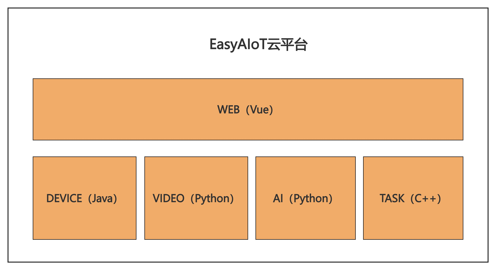

# EasyAIoT (DeepCore AI Cloud Platform)
### My vision is for this system to be accessible worldwide, achieving truly zero barriers to AI. Everyone should experience the benefits of AI, not just a privileged few.

    

## Some Thoughts on the Project
#### I believe no single programming language excels at everything. However, when three programming languages are combined, EasyAIoT will become unparalleled – and it happens that I possess this unique trait.
#### Java is suitable for platform development but not for network or AI programming. Python excels at network and AI programming but is less ideal for high-performance task execution. C++ is great for high-performance tasks but struggles with the domains of the other two. EasyAIoT envisions employing trilingual hybrid coding to build an AIoT platform that is challenging to implement, but incredibly easy to use.

#### EasyAIoT is not actually one project; it is five distinct projects.
#### What's the benefit? Suppose you are on a resource-constrained device (like an RK3588). You can extract and independently deploy just one of those projects. Therefore, while this project appears to be a cloud platform, it simultaneously functions as an edge platform.

## Project Structure
EasyAIoT consists of five core projects:
- **WEB Module**: Frontend management interface based on Vue
- **DEVICE Module**: Java-based device management module responsible for IoT device access and management
- **VIDEO Module**: Python-based video processing module responsible for video stream processing and transmission
- **AI Module**: Python-based artificial intelligence processing module responsible for video analysis and AI algorithm execution
- **TASK Module**: C++-based high-performance task processing module responsible for compute-intensive task execution

## Quick Start

### Environment Requirements
- Java 8+ (DEVICE module)
- Python 3.9+ (AI module)
- Node.js 16+ (Frontend)
- PostgreSQL (Main database)
- TDengine (Time-series database)
- Nacos (Service registry and discovery)
- Kafka (Message queue)

### Startup Steps
1. Clone the backend project: